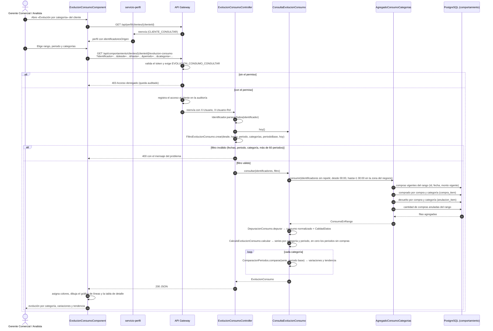

# Diagramas de la evolución del consumo por categoría (SCRUM-579)

Diagrama de clases y diagrama de secuencia de la evolución del consumo por categoría (SCRUM-32).
La lógica que implementan está en `docs/compra/evolucion-consumo-categoria.md`. Están escritos en
Mermaid: GitHub los dibuja al abrir este archivo, y para adjuntarlos a la historia en Jira se
exportan como imagen desde <https://mermaid.live>.

## Diagrama de clases

Paquetes `compra` (acceso a datos) y `evolucion` (cálculo y consulta) de `servicio-comportamiento`,
y los componentes del frontend que los consumen.

```mermaid
classDiagram
    direction LR

    namespace frontend {
        class EvolucionConsumoComponent {
            -categoriasElegidas: List~string~
            -comparacion: Comparacion
            +consultar()
            +alternarCategoria(categoria)
            +cambiarPeriodoBase(clave)
        }
        class EvolucionConsumoService {
            +consultar(idCliente, identificadores, filtro) Observable~EvolucionConsumo~
        }
    }

    namespace evolucion {
        class EvolucionConsumoController {
            +evolucion(clienteId, identificadores, desde, hasta, periodo, periodoBase, categorias) EvolucionConsumo
        }
        class ConsultaEvolucionConsumo {
            -zona: ZoneId
            +hoy() LocalDate
            +consultar(identificadores, filtro) EvolucionConsumo
        }
        class FiltroEvolucionConsumo {
            <<record>>
            desde: LocalDate
            hasta: LocalDate
            periodo: TipoPeriodo
            categorias: Set~String~
            periodos: List~Periodo~
            periodoBase: String
            +crear(desde, hasta, periodo, categorias, periodoBase, hoy)$ FiltroEvolucionConsumo
            +indiceBase() int
        }
        class TipoPeriodo {
            <<enumeration>>
            MENSUAL
            TRIMESTRAL
            ANUAL
            +parsear(texto)$ TipoPeriodo
        }
        class Periodo {
            <<record>>
            clave: String
            inicio: LocalDate
            fin: LocalDate
            parcial: boolean
            +entre(desde, hasta, tipo)$ List~Periodo~
        }
        class DepuracionConsumo {
            +SIN_CATEGORIA$ String
            +depurar(consumo)$ Resultado
        }
        class CalidadDatos {
            <<record>>
            comprasAnalizadas: long
            comprasAnuladasExcluidas: long
            registrosSinCategoria: long
            registrosSinMonto: long
            devolucionesInconsistentes: long
            comprasConDesgloseInconsistente: long
            consistente: boolean
        }
        class CalculoEvolucionConsumo {
            +calcular(periodos, zona, consumo, categorias)$ Resultado
        }
        class SerieCategoria {
            <<record>>
            categoria: String
            monto: BigDecimal
            compras: long
            unidades: long
            consumo: List~ConsumoPeriodo~
        }
        class ConsumoPeriodo {
            <<record>>
            periodo: String
            monto: BigDecimal
            compras: long
            unidades: long
        }
        class TotalPeriodo {
            <<record>>
            periodo: String
            monto: BigDecimal
            compras: long
        }
        class ComparacionPeriodos {
            +comparar(serie, indiceBase)$ SerieComparada
        }
        class SerieComparada {
            <<record>>
            categoria: String
            monto: BigDecimal
            compras: long
            unidades: long
            tendencia: Tendencia
            evolucion: List~PuntoEvolucion~
        }
        class PuntoEvolucion {
            <<record>>
            periodo: String
            monto: BigDecimal
            compras: long
            unidades: long
            variacionAnterior: Variacion
            variacionBase: Variacion
        }
        class Variacion {
            <<record>>
            monto: BigDecimal
            porcentaje: BigDecimal
        }
        class Tendencia {
            <<enumeration>>
            CRECE
            ESTABLE
            DECRECE
            DEJO_DE_COMPRAR
            SIN_CONSUMO
            SIN_COMPARACION
        }
        class EvolucionConsumo {
            <<record>>
            desde: LocalDate
            hasta: LocalDate
            periodo: TipoPeriodo
            zonaHoraria: String
            periodoBase: String
            categoriasDisponibles: List~String~
            sinDatos: boolean
        }
    }

    namespace compra {
        class AgregadoConsumoCategorias {
            +consumir(identificadores, desde, hasta) ConsumoEnRango
        }
        class ConsumoEnRango {
            <<record>>
            compras: List~CompraEnRango~
            compradas: List~LineaConsumoCategoria~
            devueltas: List~LineaConsumoCategoria~
            comprasAnuladas: long
        }
        class CompraEnRango {
            <<record>>
            idCompra: long
            fecha: OffsetDateTime
            montoVigente: BigDecimal
        }
        class LineaConsumoCategoria {
            <<record>>
            idCompra: long
            categoria: String
            unidades: long
            monto: BigDecimal
        }
        class ComprasDelCliente {
            +deIdentificadores(compra, criterios, identificadores)$ Predicate
            +vigente(compra, criterios)$ Predicate
            +montoVigente(compra, criterios)$ Expression
        }
        class Compra {
            <<entity>>
        }
        class CompraItem {
            <<entity>>
        }
        class Anulacion {
            <<entity>>
        }
        class AnulacionItem {
            <<entity>>
        }
    }

    EvolucionConsumoComponent --> EvolucionConsumoService
    EvolucionConsumoService ..> EvolucionConsumoController : HTTP GET evolucion-consumo
    EvolucionConsumoController --> ConsultaEvolucionConsumo
    EvolucionConsumoController ..> FiltroEvolucionConsumo : crea
    FiltroEvolucionConsumo --> TipoPeriodo
    FiltroEvolucionConsumo --> "1..60" Periodo
    ConsultaEvolucionConsumo --> AgregadoConsumoCategorias
    ConsultaEvolucionConsumo ..> DepuracionConsumo
    ConsultaEvolucionConsumo ..> CalculoEvolucionConsumo
    ConsultaEvolucionConsumo ..> ComparacionPeriodos
    ConsultaEvolucionConsumo ..> EvolucionConsumo : devuelve
    AgregadoConsumoCategorias ..> ComprasDelCliente
    AgregadoConsumoCategorias ..> Compra
    AgregadoConsumoCategorias ..> AnulacionItem
    AgregadoConsumoCategorias ..> ConsumoEnRango : devuelve
    Compra "1" *-- "1..*" CompraItem
    Anulacion "1" *-- "0..*" AnulacionItem
    Anulacion "0..*" --> "1" Compra
    ConsumoEnRango *-- CompraEnRango
    ConsumoEnRango *-- LineaConsumoCategoria
    DepuracionConsumo ..> CalidadDatos : informa
    CalculoEvolucionConsumo ..> SerieCategoria : agrupa
    CalculoEvolucionConsumo ..> TotalPeriodo : resume
    SerieCategoria *-- ConsumoPeriodo
    ComparacionPeriodos ..> SerieComparada : compara
    SerieComparada *-- PuntoEvolucion
    SerieComparada --> Tendencia
    PuntoEvolucion --> Variacion
    EvolucionConsumo *-- Periodo
    EvolucionConsumo *-- SerieComparada
    EvolucionConsumo *-- TotalPeriodo
    EvolucionConsumo *-- CalidadDatos
```

## Diagrama de secuencia

Consulta con filtros de cliente, categoría y fechas, desde la pantalla hasta la agregación de las
compras vigentes.

