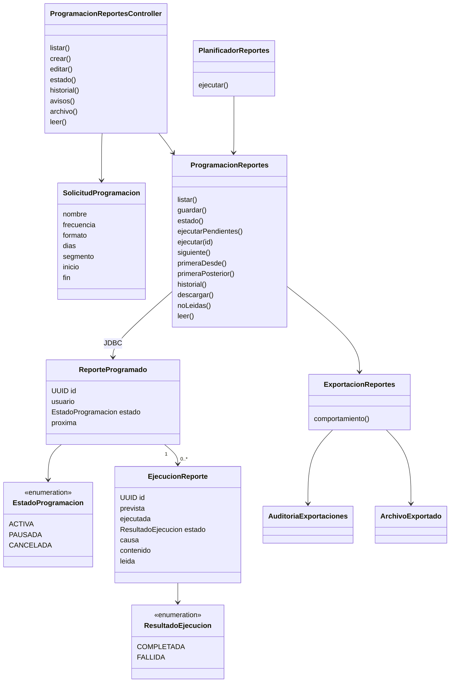
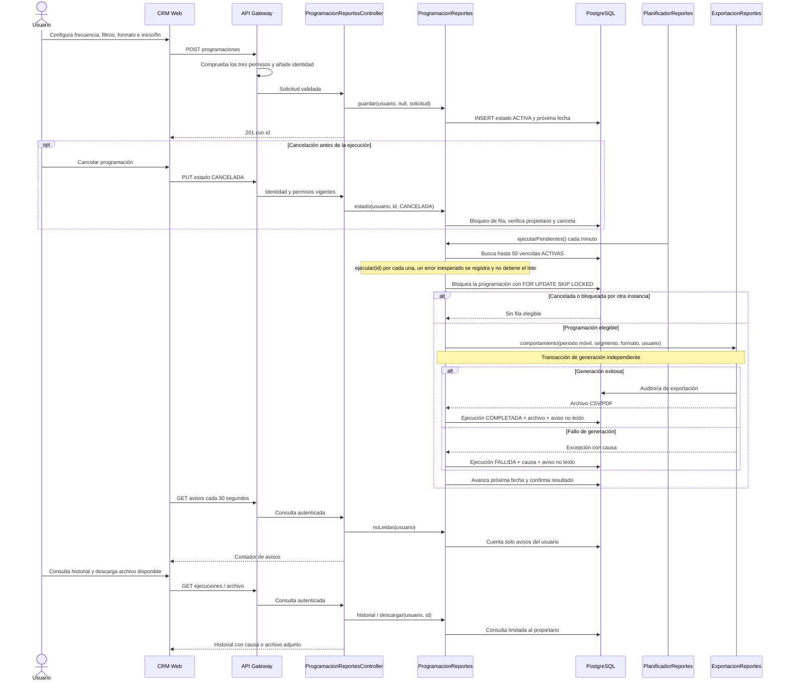

# Diagramas de programación de reportes · SCRUM-61 / SCRUM-614

## Clases

```mermaid
classDiagram
    class SolicitudProgramacion {
        nombre
        frecuencia
        formato
        dias
        segmento
        inicio
        fin
    }
    class ProgramacionReportesController {
        listar()
        crear()
        editar()
        estado()
        historial()
        avisos()
        archivo()
        leer()
    }
    class ProgramacionReportes {
        listar()
        guardar()
        estado()
        ejecutarPendientes()
        ejecutar(id)
        siguiente()
        primeraDesde()
        primeraPosterior()
        historial()
        descargar()
        noLeidas()
        leer()
    }
    class PlanificadorReportes {
        ejecutar()
    }
    class ExportacionReportes {
        comportamiento()
    }
    class EstadoProgramacion {
        <<enumeration>>
        ACTIVA
        PAUSADA
        CANCELADA
    }
    class ResultadoEjecucion {
        <<enumeration>>
        COMPLETADA
        FALLIDA
    }
    class ReporteProgramado {
        UUID id
        usuario
        EstadoProgramacion estado
        proxima
    }
    class EjecucionReporte {
        UUID id
        prevista
        ejecutada
        ResultadoEjecucion estado
        causa
        contenido
        leida
    }
    ProgramacionReportesController --> SolicitudProgramacion
    ProgramacionReportesController --> ProgramacionReportes
    PlanificadorReportes --> ProgramacionReportes
    ProgramacionReportes --> ExportacionReportes
    ProgramacionReportes --> ReporteProgramado : JDBC
    ReporteProgramado "1" --> "0..*" EjecucionReporte
    ReporteProgramado --> EstadoProgramacion
    EjecucionReporte --> ResultadoEjecucion
    ExportacionReportes --> AuditoriaExportaciones
    ExportacionReportes --> ArchivoExportado
```

## Generación, cancelación, fallo y recepción

```mermaid
sequenceDiagram
    actor Usuario
    participant UI as CRM Web
    participant GW as API Gateway
    participant API as ProgramacionReportesController
    participant S as ProgramacionReportes
    participant DB as PostgreSQL
    participant P as PlanificadorReportes
    participant E as ExportacionReportes
    Usuario->>UI: Configura frecuencia, filtros, formato e inicio/fin
    UI->>GW: POST programaciones
    GW->>GW: Comprueba los tres permisos y añade identidad
    GW->>API: Solicitud validada
    API->>S: guardar(usuario, null, solicitud)
    S->>DB: INSERT estado ACTIVA y próxima fecha
    API-->>UI: 201 con id
    opt Cancelación antes de la ejecución
        Usuario->>UI: Cancelar programación
        UI->>GW: PUT estado CANCELADA
        GW->>API: Identidad y permisos vigentes
        API->>S: estado(usuario, id, CANCELADA)
        S->>DB: Bloqueo de fila, verifica propietario y cancela
    end
    P->>S: ejecutarPendientes() cada minuto
    S->>DB: Busca hasta 50 vencidas ACTIVAS
    Note over S: ejecutar(id) por cada una, un error inesperado se registra y no detiene el lote
    S->>DB: Bloquea la programación con FOR UPDATE SKIP LOCKED
    alt Cancelada o bloqueada por otra instancia
        DB-->>S: Sin fila elegible
    else Programación elegible
        S->>E: comportamiento(periodo móvil, segmento, formato, usuario)
        Note over S,E: Transacción de generación independiente
        alt Generación exitosa
            E->>DB: Auditoría de exportación
            E-->>S: Archivo CSV/PDF
            S->>DB: Ejecución COMPLETADA + archivo + aviso no leído
        else Fallo de generación
            E-->>S: Excepción con causa
            S->>DB: Ejecución FALLIDA + causa + aviso no leído
        end
        S->>DB: Avanza próxima fecha y confirma resultado
    end
    UI->>GW: GET avisos cada 30 segundos
    GW->>API: Consulta autenticada
    API->>S: noLeidas(usuario)
    S->>DB: Cuenta solo avisos del usuario
    API-->>UI: Contador de avisos
    Usuario->>UI: Consulta historial y descarga archivo disponible
    UI->>GW: GET ejecuciones / archivo
    GW->>API: Consulta autenticada
    API->>S: historial / descargar(usuario, id)
    S->>DB: Consulta limitada al propietario
    API-->>UI: Historial con causa o archivo adjunto
```
