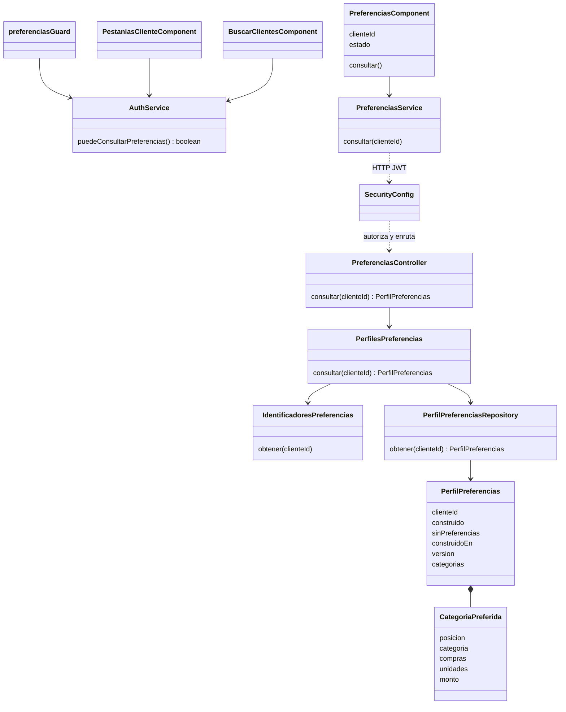
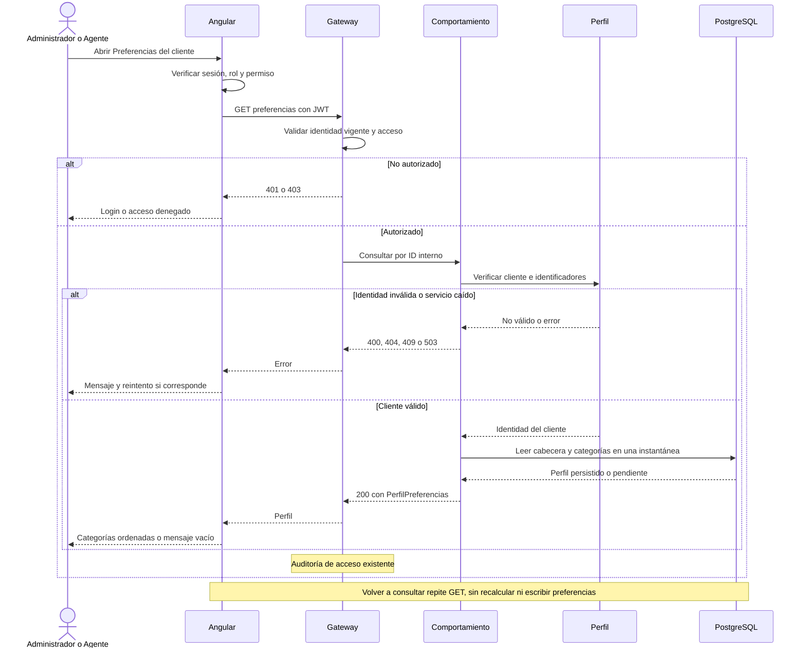

# Diagramas de consulta de preferencias — SCRUM-590

## Clases

```mermaid
classDiagram
  class PreferenciasComponent {
    clienteId
    estado
    consultar()
  }
  class AuthService {
    puedeConsultarPreferencias() boolean
  }
  class PreferenciasService {
    consultar(clienteId)
  }
  class SecurityConfig
  class PreferenciasController {
    consultar(clienteId) PerfilPreferencias
  }
  class PerfilesPreferencias {
    consultar(clienteId) PerfilPreferencias
  }
  class IdentificadoresPreferencias {
    obtener(clienteId)
  }
  class PerfilPreferenciasRepository {
    obtener(clienteId) PerfilPreferencias
  }
  class PerfilPreferencias {
    clienteId
    construido
    sinPreferencias
    construidoEn
    version
    categorias
  }
  class CategoriaPreferida {
    posicion
    categoria
    compras
    unidades
    monto
  }
  PreferenciasComponent --> PreferenciasService
  preferenciasGuard --> AuthService
  PestaniasClienteComponent --> AuthService
  BuscarClientesComponent --> AuthService
  PreferenciasService ..> SecurityConfig : HTTP JWT
  SecurityConfig ..> PreferenciasController : autoriza y enruta
  PreferenciasController --> PerfilesPreferencias
  PerfilesPreferencias --> IdentificadoresPreferencias
  PerfilesPreferencias --> PerfilPreferenciasRepository
  PerfilPreferenciasRepository --> PerfilPreferencias
  PerfilPreferencias *-- CategoriaPreferida
```

## Secuencia

```mermaid
sequenceDiagram
  actor Usuario as Administrador o Agente
  participant UI as Angular
  participant G as Gateway
  participant C as Comportamiento
  participant P as Perfil
  participant DB as PostgreSQL
  Usuario->>UI: Abrir Preferencias del cliente
  UI->>UI: Verificar sesión, rol y permiso
  UI->>G: GET preferencias con JWT
  G->>G: Validar identidad vigente y acceso
  alt No autorizado
    G-->>UI: 401 o 403
    UI-->>Usuario: Login o acceso denegado
  else Autorizado
    G->>C: Consultar por ID interno
    C->>P: Verificar cliente e identificadores
    alt Identidad inválida o servicio caído
      P-->>C: No válido o error
      C-->>G: 400, 404, 409 o 503
      G-->>UI: Error
      UI-->>Usuario: Mensaje y reintento si corresponde
    else Cliente válido
      P-->>C: Identidad del cliente
      C->>DB: Leer cabecera y categorías en una instantánea
      DB-->>C: Perfil persistido o pendiente
      C-->>G: 200 con PerfilPreferencias
      G-->>UI: Perfil
      UI-->>Usuario: Categorías ordenadas o mensaje vacío
    end
    Note over G: Auditoría de acceso existente
  end
  Note over UI,DB: Volver a consultar repite GET, sin recalcular ni escribir preferencias
```
