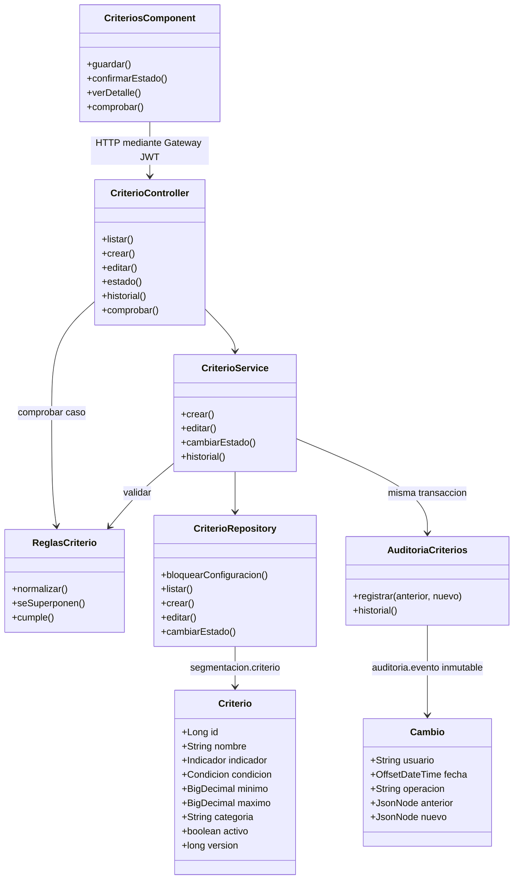
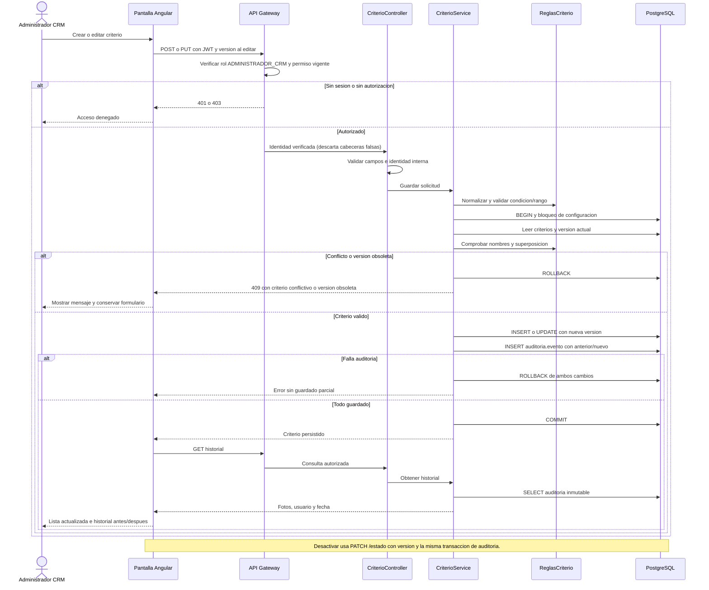

# SCRUM-25 · Diagramas de clases y secuencia

Implementación de criterios configurables de segmentación. Fuentes editables Mermaid.

## Clases

```mermaid
classDiagram
    class CriteriosComponent {
        +guardar()
        +confirmarEstado()
        +verDetalle()
        +comprobar()
    }
    class CriterioController {
        +listar()
        +crear()
        +editar()
        +estado()
        +historial()
        +comprobar()
    }
    class CriterioService {
        +crear()
        +editar()
        +cambiarEstado()
        +historial()
    }
    class Criterio {
        +Long id
        +String nombre
        +Indicador indicador
        +Condicion condicion
        +BigDecimal minimo
        +BigDecimal maximo
        +String categoria
        +boolean activo
        +long version
    }
    class ReglasCriterio {
        +normalizar()
        +seSuperponen()
        +cumple()
    }
    class CriterioRepository {
        +bloquearConfiguracion()
        +listar()
        +crear()
        +editar()
        +cambiarEstado()
    }
    class AuditoriaCriterios {
        +registrar(anterior, nuevo)
        +historial()
    }
    class Cambio {
        +String usuario
        +OffsetDateTime fecha
        +String operacion
        +JsonNode anterior
        +JsonNode nuevo
    }
    CriteriosComponent --> CriterioController : HTTP mediante Gateway JWT
    CriterioController --> CriterioService
    CriterioController --> ReglasCriterio : comprobar caso
    CriterioService --> ReglasCriterio : validar
    CriterioService --> CriterioRepository
    CriterioService --> AuditoriaCriterios : misma transaccion
    CriterioRepository --> Criterio : segmentacion.criterio
    AuditoriaCriterios --> Cambio : auditoria.evento inmutable
```

## Secuencia de alta y edición

```mermaid
sequenceDiagram
    actor Admin as Administrador CRM
    participant UI as Pantalla Angular
    participant GW as API Gateway
    participant API as CriterioController
    participant S as CriterioService
    participant R as ReglasCriterio
    participant DB as PostgreSQL
    Admin->>UI: Crear o editar criterio
    UI->>GW: POST o PUT con JWT y version al editar
    GW->>GW: Verificar rol ADMINISTRADOR_CRM y permiso vigente
    alt Sin sesion o sin autorizacion
        GW-->>UI: 401 o 403
        UI-->>Admin: Acceso denegado
    else Autorizado
        GW->>API: Identidad verificada (descarta cabeceras falsas)
        API->>API: Validar campos e identidad interna
        API->>S: Guardar solicitud
        S->>R: Normalizar y validar condicion/rango
        S->>DB: BEGIN y bloqueo de configuracion
        S->>DB: Leer criterios y version actual
        S->>R: Comprobar nombres y superposicion
        alt Conflicto o version obsoleta
            S->>DB: ROLLBACK
            S-->>UI: 409 con criterio conflictivo o version obsoleta
            UI-->>Admin: Mostrar mensaje y conservar formulario
        else Criterio valido
            S->>DB: INSERT o UPDATE con nueva version
            S->>DB: INSERT auditoria.evento con anterior/nuevo
            alt Falla auditoria
                S->>DB: ROLLBACK de ambos cambios
                S-->>UI: Error sin guardado parcial
            else Todo guardado
                S->>DB: COMMIT
                S-->>UI: Criterio persistido
                UI->>GW: GET historial
                GW->>API: Consulta autorizada
                API->>S: Obtener historial
                S->>DB: SELECT auditoria inmutable
                S-->>UI: Fotos, usuario y fecha
                UI-->>Admin: Lista actualizada e historial antes/despues
            end
        end
    end
    Note over UI,DB: Desactivar usa PATCH /estado con version y la misma transaccion de auditoria.
```
